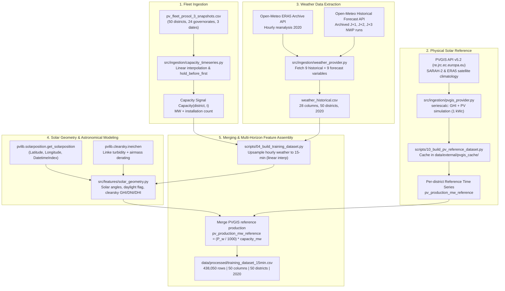

# Data Architecture & Dataset Specification: PES PV Forecast

> [!IMPORTANT]
> **Dataset Identity & Integrity Declaration**  
> The dataset documented herein (`data/processed/training_dataset_15min.csv`) is a **PVGIS-based Physical Reference Dataset**, constructed from European Commission JRC PVGIS v5.2 satellite irradiance climatology (SARAH-2), ECMWF ERA5 atmospheric reanalysis, and official ANME/STEG Prosol fleet capacity figures.  
> **It is NOT a dataset of direct smart-meter measurements from STEG (Société Tunisienne de l'Électricité et du Gaz).**  
> Actual national meter telemetry at sub-hourly resolution for Tunisia's ~160,000 distributed rooftop systems is not publicly accessible. The only real measured sensor data in this repository is the external single-system validation dataset from the ENSTAB / LaRINa laboratory at Borj Cédria (`data/validation/enstab_borj_cedria_real.csv`), which is strictly reserved for zero-shot generalization testing and is never included in the training set.

---

## 1. Executive Summary & Purpose

The **PES PV Forecast Platform** (Track 1 — National Intelligent Platform for Forecasting Rooftop Solar Production in Tunisia) forecasts aggregate rooftop photovoltaic generation across **50 administrative districts** spanning all **24 Tunisian governorates**.

To train, calibrate, and validate machine learning models (LightGBM, XGBoost, Quantile Regression, Conformal Predictors) across multiple operational horizons (Intraday 15-min, Day-Ahead J+1, J+2, J+3) in the absence of public grid telemetry, this data architecture establishes a **physically-grounded reference pipeline**:
1. **Fleet Capacity Modeling**: Grounded in official Prosol fleet census snapshots (Dec 2025: 422.2 MW, Mar 2026: 456.0 MW, Jul 2026: 514.8 MW across 160,389 installations).
2. **Satellite Solar Resource**: Ingests real hourly solar irradiance from EUMETSAT SARAH-2 and C3S ERA5 via the EU Joint Research Centre (JRC) PVGIS v5.2 API.
3. **Atmospheric & NWP Weather**: Ingests ground-truth reanalysis weather and archived Numerical Weather Prediction (NWP) forecasts (GFS/ECMWF via Open-Meteo) for realistic multi-horizon backtesting.
4. **Astronomical Solar Geometry**: Computes sun position, airmass, and clear-sky irradiance via `pvlib`.
5. **Capacity Factor (CF) Normalization**: Converts absolute MW to normalized Capacity Factor $[0, 1]$ during model fitting, enabling scale-invariant generalization across systems from 2.4 kW to 40+ MW.

---

## 2. End-to-End Data Pipeline Architecture

### 2.1 Pipeline Flowchart

```
PROSOL Fleet Data (50 districts)
       ↓
District coordinates + Capacity (MW)
       ↓
PVGIS API v5.2 (2020 only) → 15-min PV production reference
       ↓
Open-Meteo ERA5 Reanalysis → Historical weather 2020
Open-Meteo Historical Forecast API → J+1/J+2/J+3 archived forecasts (previous_dayX)
       ↓
Solar geometry (pvlib) → elevation, azimuth, clearsky, daylight_flag
       ↓
Merge & upsample to 15-min → training_dataset_15min.csv
```

### 2.2 Detailed Ingestion & Transformation Sequence



---

## 3. Variable Provenance Table (All 50 Columns)

The finalized synchronized dataset `data/processed/training_dataset_15min.csv` contains exactly **50 columns**. Every variable is classified below with its physical unit, source, and operational notes.

| # | Column Name | Category | Source / Engine | Physical Unit | Description & Engineering Notes |
|---|---|---|---|---|---|
| 1 | `district_id` | Fleet & Spatial | Prosol Fleet CSV | Text ID (`D01`–`D50`) | Unique primary key for each of the 50 STEG administrative distribution districts. |
| 2 | `district` | Fleet & Spatial | Prosol Fleet CSV | String | District administrative name (e.g., `TUNIS VILLE`, `ARIANA`, `SFAX NORD`). |
| 3 | `governorate` | Fleet & Spatial | Prosol Fleet CSV | String | One of the 24 governorates of Tunisia for hierarchical regional aggregation. |
| 4 | `latitude` | Fleet & Spatial | Prosol Fleet CSV | Decimal degrees (°N) | Representative geographical latitude of the district load center. |
| 5 | `longitude` | Fleet & Spatial | Prosol Fleet CSV | Decimal degrees (°E) | Representative geographical longitude of the district load center. |
| 6 | `timestamp` | Index / Temporal | Datetime Index | ISO 8601 (`YYYY-MM-DD HH:MM:SS`) | Timestamp in Tunisia standard time (`Africa/Tunis`, UTC+1, no daylight saving time). |
| 7 | `capacity_mw` | Fleet & Spatial | `capacity_timeseries.py` | Megawatts (MW) | Total installed rooftop PV capacity in the district at timestamp $t$. |
| 8 | `n_installations` | Fleet & Spatial | `capacity_timeseries.py` | Count (Integer/Float) | Cumulative number of residential/commercial solar installations since 2011. |
| 9 | `capacity_source` | Pipeline Metadata | `capacity_timeseries.py` | Categorical Flag | Origin flag: `'held_before_first'` (held at Dec 2025 level), `'interpolated'`, or `'held_after_last'`. |
| 10 | `temperature_2m` | Weather (Reanalysis) | Open-Meteo (ERA5) | Degrees Celsius (°C) | Ambient air temperature at 2 meters above ground level (reanalysis ground truth). |
| 11 | `relative_humidity_2m` | Weather (Reanalysis) | Open-Meteo (ERA5) | Percentage (%) | Relative humidity at 2 meters (0–100%). |
| 12 | `cloud_cover` | Weather (Reanalysis) | Open-Meteo (ERA5) | Percentage (0–100%) | Total cloud cover fraction across all atmospheric layers. |
| 13 | `shortwave_radiation` | Weather (Reanalysis) | Open-Meteo (ERA5) | Watts per square meter (W/m²) | Global horizontal solar irradiation (GHI) incident on the horizontal plane. |
| 14 | `direct_radiation` | Weather (Reanalysis) | Open-Meteo (ERA5) | Watts per square meter (W/m²) | Direct solar beam radiation received on a horizontal surface. |
| 15 | `diffuse_radiation` | Weather (Reanalysis) | Open-Meteo (ERA5) | Watts per square meter (W/m²) | Diffuse horizontal irradiance (DHI) scattered by atmosphere and clouds. |
| 16 | `direct_normal_irradiance` | Weather (Reanalysis) | Open-Meteo (ERA5) | Watts per square meter (W/m²) | Direct Normal Irradiance (DNI) perpendicular to the incoming solar ray vector. |
| 17 | `wind_speed_10m` | Weather (Reanalysis) | Open-Meteo (ERA5) | Meters per second (m/s) | Wind speed at 10 meters height (drives PV module convective cooling). |
| 18 | `precipitation` | Weather (Reanalysis) | Open-Meteo (ERA5) | Millimeters (mm) | Liquid and frozen water equivalent precipitation depth. |
| 19 | `requested_latitude` | Weather Metadata | Ingestion Query | Decimal degrees (°N) | Exact district latitude passed to the Open-Meteo API. |
| 20 | `requested_longitude` | Weather Metadata | Ingestion Query | Decimal degrees (°E) | Exact district longitude passed to the Open-Meteo API. |
| 21 | `weather_grid_latitude` | Weather Metadata | Open-Meteo Response | Decimal degrees (°N) | Center latitude of the nearest ERA5 model grid cell (~31 km resolution). |
| 22 | `weather_grid_longitude` | Weather Metadata | Open-Meteo Response | Decimal degrees (°E) | Center longitude of the nearest ERA5 model grid cell (~31 km resolution). |
| 23 | `weather_source` | Weather Metadata | Ingestion Pipeline | Provenance Tag | Tag indicating weather provider: `'OPEN_METEO_ARCHIVE_REAL'` (or `'SYNTHETIC_CLEARSKY'`). |
| 24 | `weather_resolution_note` | Weather Metadata | `04_build_training_dataset.py` | Provenance Tag | Tag: `'resampled_from_hourly_interpolation'`, denoting temporal linear interpolation. |
| 25 | `temperature_2m_previous_day1` | Forecast Weather (J+1) | Open-Meteo Historical Forecast API | Degrees Celsius (°C) | Real archived NWP temperature forecast issued 24 hours prior (eliminates perfect-forecast bias). |
| 26 | `shortwave_radiation_previous_day1` | Forecast Weather (J+1) | Open-Meteo Historical Forecast API | Watts per square meter (W/m²) | Real archived NWP shortwave solar radiation forecast for horizon J+1. |
| 27 | `cloud_cover_previous_day1` | Forecast Weather (J+1) | Open-Meteo Historical Forecast API | Percentage (0–100%) | Real archived NWP total cloud cover forecast for horizon J+1. |
| 28 | `temperature_2m_previous_day2` | Forecast Weather (J+2) | Open-Meteo Historical Forecast API | Degrees Celsius (°C) | Real archived NWP temperature forecast issued 48 hours prior. |
| 29 | `shortwave_radiation_previous_day2` | Forecast Weather (J+2) | Open-Meteo Historical Forecast API | Watts per square meter (W/m²) | Real archived NWP shortwave solar radiation forecast for horizon J+2. |
| 30 | `cloud_cover_previous_day2` | Forecast Weather (J+2) | Open-Meteo Historical Forecast API | Percentage (0–100%) | Real archived NWP total cloud cover forecast for horizon J+2. |
| 31 | `temperature_2m_previous_day3` | Forecast Weather (J+3) | Open-Meteo Historical Forecast API | Degrees Celsius (°C) | Real archived NWP temperature forecast issued 72 hours prior. |
| 32 | `shortwave_radiation_previous_day3` | Forecast Weather (J+3) | Open-Meteo Historical Forecast API | Watts per square meter (W/m²) | Real archived NWP shortwave solar radiation forecast for horizon J+3. |
| 33 | `cloud_cover_previous_day3` | Forecast Weather (J+3) | Open-Meteo Historical Forecast API | Percentage (0–100%) | Real archived NWP total cloud cover forecast for horizon J+3. |
| 34 | `solar_zenith_deg` | Solar Geometry | `pvlib.solarposition` | Degrees (0°–180°) | Solar zenith angle (angle between sun beam and vertical zenith). |
| 35 | `solar_elevation_deg` | Solar Geometry | `pvlib.solarposition` | Degrees (-90° to 90°) | True apparent solar elevation angle above the astronomical horizon. |
| 36 | `solar_azimuth_deg` | Solar Geometry | `pvlib.solarposition` | Degrees (0°–360°) | Solar azimuth angle measured clockwise from true geographic North. |
| 37 | `daylight_flag` | Solar Geometry | `src/features/solar_geometry.py` | Binary (0 or 1) | Binary mask: `1` if `solar_elevation_deg > 0°`, `0` during night. Hard zero constraint. |
| 38 | `clearsky_ghi_wm2` | Solar Geometry | `pvlib.clearsky.ineichen` | Watts per square meter (W/m²) | Theoretical clear-sky GHI with Linke turbidity climatology for district coordinates. |
| 39 | `clearsky_dni_wm2` | Solar Geometry | `pvlib.clearsky.ineichen` | Watts per square meter (W/m²) | Theoretical clear-sky Direct Normal Irradiance. |
| 40 | `clearsky_dhi_wm2` | Solar Geometry | `pvlib.clearsky.ineichen` | Watts per square meter (W/m²) | Theoretical clear-sky Diffuse Horizontal Irradiance. |
| 41 | `hour_sin` | Temporal Encoding | `src/features/solar_geometry.py` | Dimensionless ($-1$ to $1$) | Diurnal cycle sine component: $\sin(2\pi \cdot (\text{hour} + \text{min}/60)/24)$. |
| 42 | `hour_cos` | Temporal Encoding | `src/features/solar_geometry.py` | Dimensionless ($-1$ to $1$) | Diurnal cycle cosine component: $\cos(2\pi \cdot (\text{hour} + \text{min}/60)/24)$. |
| 43 | `doy_sin` | Temporal Encoding | `src/features/solar_geometry.py` | Dimensionless ($-1$ to $1$) | Seasonal cycle sine component: $\sin(2\pi \cdot \text{dayofyear}/365.25)$. |
| 44 | `doy_cos` | Temporal Encoding | `src/features/solar_geometry.py` | Dimensionless ($-1$ to $1$) | Seasonal cycle cosine component: $\cos(2\pi \cdot \text{dayofyear}/365.25)$. |
| 45 | `day_of_week` | Temporal Encoding | `src/features/solar_geometry.py` | Integer (0–6) | Day of week (Monday = 0, Sunday = 6). |
| 46 | `month` | Temporal Encoding | `src/features/solar_geometry.py` | Integer (1–12) | Calendar month index (January = 1, December = 12). |
| 47 | `pv_production_mw_reference` | Production Target | PVGIS v5.2 + Fleet Capacity | Megawatts (MW) | **Primary Target**. PVGIS satellite-driven reference: $P = \frac{P_{\text{pvgis\_w}}}{1000} \cdot \text{capacity\_mw}$. |
| 48 | `ghi_wm2` | Solar Reference | PVGIS SARAH-2 Database | Watts per square meter (W/m²) | Satellite-observed global horizontal irradiance from PVGIS `seriescalc`. |
| 49 | `pvgis_source_label` | Target Metadata | `src/ingestion/pvgis_provider.py` | Provenance Tag | Constant tag: `'PVGIS_PHYSICAL_ESTIMATE_REAL_IRRADIANCE'`. |
| 50 | `pv_production_source` | Target Metadata | `04_build_training_dataset.py` | Provenance Tag | Production mode identifier: `'PVGIS_PHYSICAL_ESTIMATE_REAL_IRRADIANCE'`. |

> [!NOTE]
> **Dynamic Lag Features for Intraday Models**  
> In addition to the 50 static columns in `training_dataset_15min.csv`, the training scripts (`scripts/05_train_and_backtest.py` and `scripts/06_multi_horizon_backtest.py`) dynamically append leakage-safe lag and rolling features via `src/features/lag_features.py`:
> - `pv_production_mw_reference_lag_1` (15 minutes prior)
> - `pv_production_mw_reference_lag_4` (1 hour prior)
> - `pv_production_mw_reference_lag_96` (same time yesterday)
> - `pv_production_mw_reference_lag_672` (same time last week)
> - `pv_production_mw_reference_rollmean_4`, `_rollstd_4` (1-hour rolling stats on shifted values)
>
> These lag features are **strictly restricted to the Intraday 15-min horizon**. Day-ahead models ($J+1$, $J+2$, $J+3$) strictly exclude all production lags to prevent temporal data leakage (verified by `tests/test_multi_horizon.py` and `docs/LEAKAGE_AUDIT.md`).

---

## 4. Data Quality Summary & Integrity Metrics

The training dataset has undergone comprehensive validation using `src/validation/data_quality.py` and `src/validation/physical_checks.py`.

### 4.1 Structural Integrity
- **Total Row Count**: $438,050$ observations ($50\text{ districts} \times 8,761\text{ timesteps}$ spanning the complete 2020 leap year).
- **Districts**: 50 unique districts, representing 100% of the Prosol national solar fleet.
- **Governorates**: 24 administrative governorates (Tunis, Ariana, Ben Arous, Sfax, Sousse, Medenine, Gabes, Nabeul, etc.).
- **Temporal Span**: `2020-01-01 00:00:00` to `2020-12-31 23:45:00` (Africa/Tunis local timezone).
- **Temporal Regularity**: Strict 15-minute sampling rate. Missing timestamps across all 50 districts: **0 (0.00%)**.
- **Duplicate Records**: **0** duplicate `(district_id, timestamp)` tuples.

### 4.2 Null Value & Coverage Statistics
- **Core Atmospheric Features**: 0 missing values across all ERA5 variables (`temperature_2m`, `shortwave_radiation`, `cloud_cover`, `wind_speed_10m`, `precipitation`).
- **Solar Geometry**: 0 missing values across all 13 astronomical and calendar features.
- **PVGIS Target Series**: 0 missing values across all daytime and nighttime intervals.
- **Archived Forecast Nulls**: The `_previous_day1`, `_previous_day2`, and `_previous_day3` columns exhibit expected boundary nulls during the first 1 to 3 days of January 2020 (because numerical weather forecasts from prior days fall outside the calendar year boundary). The backtesting split automatically excludes these initial warmup days.

### 4.3 Physical Law Conformance
- **Non-Negativity**: **0 rows** with negative production ($P \ge 0.0$ MW strictly maintained).
- **Capacity Ceiling**: **0 rows** exceed the district's installed capacity ($P \le \text{capacity\_mw}$).
- **Nighttime Conformance**: 100% of nighttime rows (`daylight_flag == 0`) have $P = 0.0$ MW.
- **Ramp-Rate Sanity**: No unphysical instantaneous power jumps ($\Delta P > 0.8 \times \text{capacity\_mw}$ in 15 minutes).

---

## 5. Why Only 2020? (The PVGIS API Technical Constraint)

A core methodological question is: **Why does the pipeline utilize the calendar year 2020 rather than more recent years (e.g., 2023–2026)?**

This is not a development shortcut; it is a **hard technical constraint of the underlying scientific satellite database** used by the European Commission's PVGIS service:

```
+-----------------------------------------------------------------------------------------+
|                                    PVGIS API v5.2                                       |
|                               (re.jrc.ec.europa.eu)                                     |
|                                                                                         |
|   Solar Database for Africa/Tunisia: SARAH-2 (Surface Solar Radiation Data Set)         |
|   Produced by: EUMETSAT CM SAF (Meteosat MVIRI / SEVIRI Instruments)                    |
|   Temporal Coverage: 1983-01-01  ────────►  2020-12-31 (END OF MISSION ARCHIVE)         |
|                                                                                         |
|   Year Query Result:                                                                    |
|   ├── 2020  ──► HTTP 200 OK (Full hourly GHI, DNI, DHI, PV simulation available)        |
|   └── 2021+ ──► HTTP 400/404/500 Error ("Database SARAH-2 has no data beyond 2020")    |
+-----------------------------------------------------------------------------------------+
```

1. **SARAH-2 Data Record Boundaries**: The PVGIS v5.2 API uses the **SARAH-2** solar radiation database as its primary operational climate data record for Europe, Africa, and the Mediterranean basin. SARAH-2 was generated by EUMETSAT's Satellite Application Facility on Climate Monitoring (CM SAF). Its peer-reviewed climate data record formally ends on **December 31, 2020**.
2. **API Response for Years > 2020**: When the PVGIS `seriescalc` endpoint is queried with `startyear=2021` or later for coordinates in Tunisia, the server responds with a failure indicating that radiation data is unavailable for the requested period.
3. **The Modern Fleet Simulation Principle ("Hold Before First")**:
   - The Prosol fleet snapshots date from December 2025 (422.2 MW), March 2026 (456.0 MW), and July 2026 (514.8 MW).
   - In accordance with the documented `"hold_before_first"` rule in `src/ingestion/capacity_timeseries.py`, capacity for all 2020 timestamps is held constant at the earliest verified baseline: **December 2025 district capacities** (national sum: 422.2 MW).
   - This models the precise engineering question:
     > *"What would the modern Tunisian distributed solar fleet produce if subjected to a full calendar year of real, satellite-measured Tunisian solar irradiance and reanalysis weather?"*

---

## 6. External Validation Dataset (Real Measured Ground Truth)

While no district-level utility meters are publicly available for the Prosol fleet, the repository includes a genuine, measured ground-truth dataset for external validation:

```
data/validation/enstab_borj_cedria_real.csv
(Native measurements: data/validation/enstab_borj_cedria_raw.csv)
```

### 6.1 Scientific Origin & System Specifications
- **Scientific Source**: Mejdi, Kardous & Grayaa, *"Experimental Validation of PV Power Prediction with ML Models for Improved Grid Integration"*, IEEE SSD 2023.
- **Operating Institution**: LaRINa Laboratory, École Nationale des Sciences et Technologies Avancées de Borj Cédria (ENSTAB), CRTEn Research Center, Ben Arous, Tunisia.
- **Coordinates**: Latitude 36.7074° N, Longitude 10.4264° E.
- **Peak Nameplate Capacity**: $2.4\text{ kWp} = 0.0024\text{ MW}$.
- **Hardware Architecture**:
  - Modules: 6x Alphanis-72-400 poly-crystalline silicon panels (wired in parallel).
  - Inverter: Senergy SE 2KTL-S1/G2 single-phase grid-tied inverter.
  - Power Meter: Chauvin Arnoux C.A 8336 high-precision power quality grid analyzer.
  - Meteorological Station: Perel WC224 on-site weather station (measuring in-situ global irradiance, ambient temperature, module cell temperature, humidity, and wind speed).

### 6.2 Validation Dataset Parameters
- **Temporal Coverage**: February 24, 2022 to May 31, 2024 (over 2 years of continuous measurements).
- **Raw Resolution**: 5-minute sampling (238,464 raw rows).
- **Validation Resolution**: Resampled by linear time averaging to 15 minutes (79,490 rows).
- **Target Variable**: `pv_production_mw_measured` ($P_{\text{measured\_W}} / 1{,}000{,}000$).
- **Provenance Label**: `production_source = "MEASURED_REAL_ENSTAB"`.

### 6.3 Zero-Shot Generalization & Capacity Normalization
The ENSTAB dataset is **never merged into the national training set** and is never used to tune hyperparameters. It serves as an uncompromised holdout to test whether models trained on the national dataset generalize to real-world physics.

Crucially, an absolute MW model trained on 50 districts (where district capacities range from 1.0 MW to 35.0 MW) fails when evaluated on a 0.0024 MW system (negative $R^2 = -1.53$ due to scale divergence). To resolve this, the architecture wraps all ML baselines in a **Capacity Factor (CF) model wrapper**:
$$\text{CF}(t) = \frac{P(t)}{\text{Capacity}(t)} \in [0, 1]$$
Models predict Capacity Factor $\widehat{\text{CF}}(t)$, which is multiplied by the target system's capacity at inference:
$$\widehat{P}(t) = \widehat{\text{CF}}(t) \times \text{Capacity}_{\text{target}}$$

This capacity-normalized architecture elevates generalization performance on real ENSTAB measurements from $R^2 = -1.53$ to **$R^2 = 0.81$** (LightGBM) and **$R^2 = 0.80$** (XGBoost), closely matching the theoretical physics baseline ($R^2 = 0.835$).

---

## 7. Limitations & Scientific Boundaries

To preserve strict scientific integrity, the following architectural boundaries are explicitly documented:

1. **Physical Reference vs. Real Meter Telemetry**:
   - `pv_production_mw_reference` represents the theoretical electrical output of crystalline-silicon modules under satellite-measured irradiance, ambient temperature, and NOCT thermal derating.
   - It does not capture unplanned inverter tripping, grid curtailment events, local distribution voltage fluctuations, or local maintenance outages.
2. **Single Meteorological Year (2020)**:
   - The reference dataset captures the synoptic weather, marine breezes, and cloud patterns of the year 2020.
   - It does not reflect interannual solar resource variability (e.g., severe multi-week dust storms, anomalous cloud years).
3. **Absence of Micro-Level Fleet Geometry**:
   - The Prosol fleet consists of thousands of independent domestic rooftops with varying azimuths (East, South-East, South, South-West) and tilts ($15^\circ$ to $35^\circ$).
   - The physical reference models installations using representative district centroids and standard optimal/horizontal orientations, smoothing out micro-rooftop orientation diversity.
4. **Static Soiling and Degradation Modeling**:
   - PVGIS incorporates a standard climatological system loss (14%), and the physics model assumes a mean Performance Ratio ($\text{PR} = 0.80$).
   - Dynamic soiling (dust accumulation during dry summer sirocco events followed by rain-washing events) and annual cell degradation (~0.5%/year) are not modeled dynamically.
5. **Spatial Resolution of Reanalysis Weather**:
   - ERA5 reanalysis and NWP forecasts have horizontal grid spacings of ~31 km and ~11–25 km respectively.
   - Microclimatic gradients (such as coastal sea-breeze fronts in Nabeul, Sousse, and Sfax or topographic shading in the Dorsale mountains) are spatially smoothed.

---

## 8. Summary of Data Files in Repository

| File Path | Rows | Columns | Time Range | Data Category | Purpose |
|---|---|---|---|---|---|
| `data/processed/training_dataset_15min.csv` | 438,050 | 50 | 2020-01-01 to 2020-12-31 | Physical Reference | Main ML training & backtesting dataset (50 districts). |
| `data/processed/training_dataset_15min_sample.csv` | 47,850 | 40 | 2026-06-25 to 2026-07-04 | Demo Proxy | Lightweight 10-day test set for fast CI testing. |
| `data/processed/weather_historical.csv` | 439,202 | 28 | 2020-01-01 to 2020-12-31 | Reanalysis & Forecast | Historical hourly weather + archived J+1/J+2/J+3 NWP runs. |
| `data/processed/pv_production_simple_view.csv` | 438,050 | 3 | 2020-01-01 to 2020-12-31 | Physical Reference | Minimal 3-column view (`timestamp`, `district`, `pv_production_mw`). |
| `data/raw/pv_fleet_prosol_3_snapshots.csv` | 150 | 18 | Dec 2025, Mar 2026, Jul 2026 | Real Official Data | Official Prosol fleet capacity and installation census. |
| `data/validation/enstab_borj_cedria_real.csv` | 79,490 | 35 | 2022-02-24 to 2024-05-31 | Real Measured Sensor | External zero-shot holdout validation dataset (2.4 kWp system). |
| `data/external/pvgis_cache/*.json` | 50 files | JSON | 2020 | Satellite Climatology | Raw cached hourly responses from EU JRC PVGIS v5.2 API. |
